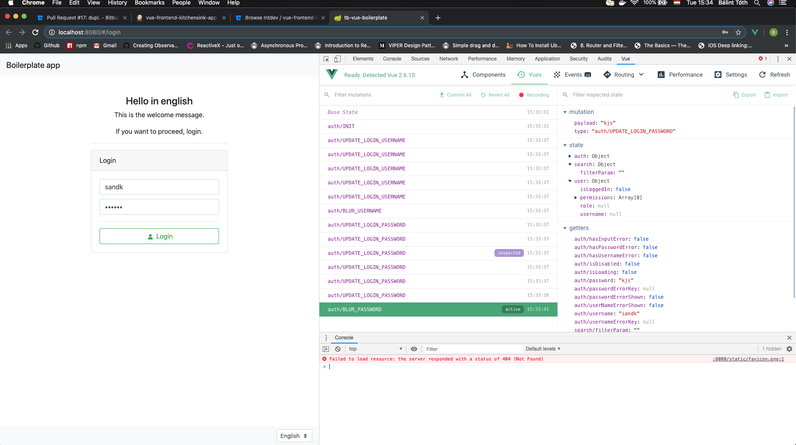

# VueJS

This boilerplate app uses VueJS and the recommended libraries to build scaleable SPAs (single page application) with it.

## Overview:
  - [Vuex](https://vuex.vuejs.org/) - state management
  - [Axios](https://github.com/axios/axios) - promise based http client
  - [Vue Router](https://router.vuejs.org/)
  - [Vue I18n](http://kazupon.github.io/vue-i18n/started.html#html)
  - [Bootstrap vue](https://bootstrap-vue.js.org/docs/)
  - [Vue notifications](https://www.npmjs.com/package/vue-notification)
  - [Vueawesome](https://github.com/Justineo/vue-awesome) - icons (Fontawesome)

##### Testing:
  - [Karma](https://karma-runner.github.io/0.8/index.html) - test runner/reporter
  - [Mocha](https://mochajs.org/) - assertions
  - [Sinon](https://sinonjs.org/) - mocking
  - [Axios mock adapter](https://github.com/ctimmerm/axios-mock-adapter) - api mocking
  - [Stryker](https://stryker-mutator.io/stryker/quickstart) - mutation testing
  - [Selenium](https://medium.com/the-hitchhikers-guide-to-e2e-testing/part-i-e2e-testing-and-selenium-ef031978ee20) - e2e _(not frontend scope)_


## State management with Vuex

##### Overview
_"Vuex is a state management pattern + library for Vue.js applications. It serves as a centralized store for all the components in an application, with rules ensuring that the state can only be mutated in a predictable fashion."_


Vuex is a tradeoff, which complicates simple VueJS solutions. These solutions remain valid for prototyping. It still worths it however, as it leads to the aforementioned predictable mutations, and with that comes the great testability and fewer bugs.

##### Example - simple VueJS component:
A single file is enough (_login-component.vue_)
```html
<template>
  <input v-model="username">
  <p v-if="username.length < 3">Too short!</p>
</template>
```
```javascript
export default {
  data: {
    username: ""
  }
}
```

##### Example - with Vuex:
In a module of the store (_store/login.js_)
```javascript
const namespaced = true

const state = () => { return {
  username: ""
}}

const mutations = {
  UPDATE_USERNAME(state, value) {
    state.username = value
  }
}

const getters = {
  username: state => state.username,
  usernameIsShort: state => state.username.length < 3
}

const actions = {
  updateUsername({ commit }, value) {
    return commit('UPDATE_USERNAME', value)
  }
}

export default {
  namespaced,
  state,
  mutations,
  getters,
  actions
}
```

(Setup the store in main.js, register the module and... ...in the component (_components/login-component.vue_)
```html
<template>
  <input :value="username" @input="updateUsername">
  <p v-if="usernameIsShort">Too short!</p>
</template>
```
```javascript
import { mapGetters, mapActions } from 'vuex'

export default {
  computed: {
    ...mapGetters('login', [
      'username', 'usernameIsShort'
    ])
  },
  methods: {
    ...mapActions('login', [
      'updateUsername'
    ])
  }
}
```
These two examples do exactly the same. There are some huge differences however development-wise.

The cons of vuex seems obvious:
  - More files
  - More code (at the beginning)
  - Less intuitive

The pros come as the project grows:
  - parent-child / sibling communication

    Usually, a variable should be used in more than one component.
    Vue provides a way for this: passing _props_ from parent to child components, and listening to _events_, emitted by child on parents components. In simple prototypes it might work just fine, however as the app gets bigger, and more nested components are created, this means that a component might receive props/events only to pass them towards. Also, it is not necessarily obvious, where some piece of data should be stored (on which component).

    Example ("siblings")

    ```html
    <!-- container.vue -->
    <div class="my-container">
      <custom-input-component
        :username="username">
      </custom-input-component>
      <custom-label-component
        :usernameErrorExists="usernameErrorExists">
      </custom-label-component>
    </div>

    <!-- We may define username on the common parents -->
    <!-- This "pattern" leads to defining all data and methods on the "root" component -->
    ```

    Example ("grandchild-grandparent"):

    ```html
    <!-- container.vue -->
    <div class="my-container">
      <custom-input-component
        :username="username"
        :usernameErrorExists="usernameErrorExists">
      </custom-input-component>
    </div>

    <!-- If we DO define some data on the root component -->
    <!-- Username is defined in this component in data -->
    <!-- usernameErrorExists is defined in this component in computed -->
    ```

    ```html
    <!-- input.vue -->
    <div class="my-input">
      <input type="text" :value="username">
      <custom-label-component
        :usernameErrorExists="usernameErrorExists">
      </custom-label-component>
    </div>

    <!-- Receives username as prop because it is needed here -->
    <!-- Receives usernameErrorExists as prop - ONLY TO PASS IT TOWARDS -->
    ```

    ```html
    <!-- label.vue -->
    <div class="my-label">
      <p v-if="usernameErrorExists">Not good!</p>
      <p v-else>Good!</p>
    </div>

    <!-- Receives usernameErrorExists as prop from input -->
    ```

    Example ("event bus")

    ```js
    // main.js

    export const eventBus = new Vue()
    ```

    ```html
    <!-- input.vue template -->
    <div class="my-input">
      <input type="text" v-model="username" @input="emitUsernameChange">
    </div>
    ```

    ```js
    // input.vue script
    import { eventBus } from '@/main.js'

    export default {
      data() {
        return {
          username: ""
        }
      },
      methods: {
        emitUsernameChange(value) {
          eventBus.emit("usernameChanged", value)
        }
      }
    }
    ```

    ```html
    <!-- label.vue template -->
    <div class="my-label">
      <p v-if="usernameErrorExists">Not good!</p>
      <p v-else>Good!</p>
    </div>
    ```

    ```js
    // label.vue script
    import { eventBus } from '@/main.js'

    export default {
      data() {
        return {
          usernameErrorExists: false
        }
      },
      created() {
        eventBus.on("usernameChanged", (value) => this.usernameErrorExists = value.length > 3)
      }
    }
    ```

    ```html
    <!-- container.vue -->
    <div class="my-input">
      <custom-input-component>
      </custom-input-component>
      <custom-label-component>
      </custom-label-component>
    </div>

    <!-- Here we do not need to define anything on parent -->
    ```

    All these previous examples are valid ways to pass __data__ around in the application. They can work together, creating an awful mess, and also, similarly you can even pass around __events__ and __methods__ as well.

    When all these "patterns" are applied randomly, a larger app will soon be almost impossible to debug and for sure impossible to build upon. Soon it will be hard to reason about why a particular data/method was described on a particular component, and even to find where exactly some property was defined.

    This is the problem that Vuex's pattern - which __is__ a pattern, see [flux](https://facebook.github.io/flux/docs/in-depth-overview.html) - aims to solve with its unidirectional data flow.


  - Debug options

    While the usual way of "debugging" is console.log everything in the browser (...) Vue provides awesome devtools for Vuex.

    

    - Every single mutation is tracked
    - "Time travelling" is possible
    - State and getters can be checked for every mutation


  - Testability

    Vue components shall be thins layers above store, responsible only to capture user interactions and presenting data. With mapState and mapGetters, one can easily observe changes on data in any component, and emit events form anywhere.

    The store is where the business logic is implemented, and by properly testing (see below) actions and getters the app will not be error prone.

Read more about Vuex at its [site](https://vuex.vuejs.org/).

##### Best practices
- api: mapGetters, mapActions (to test)
- no mapState or mapMutations in components
- usually no other data/methods/computed/watcher/props on component
- local data/logic exceptions
  - v-model based third party component
  - two way computed property (computed with get/set)
  - notifications state
  - router state
  - i18n state
  - poc phase for complex third party lib
- usually defined on component: create and destroy - lifecycle methods if needed

##### DEMO in boilerplate
Setup made:

In the boilerplate data is only modified in store, with the login card component being the best example of who thin a layer can be (with only presenting data and capturing event) even for sophisticated journeys.

## HTTP - TODO
Axios
Promise based
defaults to JSON
mock in prod - uncomment require, set true/false, add methods
Todo - Vue3 - coming soon - better typescript support - swagger-typescript-axios code gen

## Mock - TODO
Axios mock adapter
For testing and ui
Both of them already set up - easy to toggle even partial

## Routing - TODO
Vue router
Guards - tested vuex getters - no direct test necessary

## Testing

### Unit testing

Properly using vuex for managing the state of the application makes the code testable. Two folders __must__ be covered with tests, _util_ and _store_. As the API of the store are the getters and the actions (see above), these should be tested. [Karma test runner](https://karma-runner.github.io/0.8/index.html) provides 4 different coverage metrics, their meaning and the related breakpoints are the following:

Branches:
  - A missing branch means a not tested path in an if-else/switch statement
  - Probably contains a commit, a routing or at least a notification
  - __No reason to leave out any of them - no reason not to reach 100%__

Functions:
  - A missing function can mean a getter or an action, which means a part of the API is not tested
  - A missing function can also mean mutation or an other local function (~private methods)
  - A missing function in a util module means the api or a private function
  - Not testing "private" functions are advised - obviously a missing function means that it was not called anywhere during the test, not even by other functions (direct call is not necessary)
  - __No reason to leave out any of them - no reason not to reach 100%__

Statements & lines:
  - A missing line or statement _can_ mean an import or an export
  - In certain (unlikely) edge cases this could mean proper coverage with less then 50% (lots of - tested - imported utils and the export)
  - __Usually with the two previous breakpoints it reaches ~90%__


#### DEMO in boilerplate
Setup made:
  - test/karma.conf.js
  - test/util/testStoreFactory.js
    - enables a clean start in every test
    - router is stubbed
    - notifications are stubbed
    - axios mock adapter is set up
  - test/util/sinonAssertions.js
    - to test the number of routings
    - to test the destinations
    - to test number of notifications
    - to test the messages of notifications
  - test/specs
    - check already written tests
    - follow the pattern for further utils and modules

Run command:
```bash
# package.json
npm run unit
```

Reports:
```bash
# package.json
npm run coverage-report
# check in browser at http://localhost:8088
```


### Mutation testing

A 100% code coverage does __not__ mean that all edge cases are well tested.

Example:
```javascript
// store.js
actions: {
  addNumber({ commit }, number) {
    if (x > 5)
      commit('ADD_TO_BIG_NUMBERS', number)
    else
      commit('ADD_TO_SMALL_NUMBERS', number)
  }
}
```

The following tests provide 100% coverage  - all lines are _covered_
```javascript
// store.spec.js
describe('Store tests', () => {
  it('should add to big numbers when number is bigger then 5', () => {
    // given
    let store = testStore()

    // when
    store.dispatch('addNumber', 6)

    // then
    expect(store.getters["bigNumbers"].length).to.equal(1)
  })

  it('should not add to big numbers when number is not bigger then 5', () => {
    // given
    let store = testStore()

    // when
    store.dispatch('addNumber', 5)

    // then
    expect(store.getters["bigNumbers"].length).to.equal(0)
  })
})
```

Notice that the following line
```javascript
commit('ADD_TO_SMALL_NUMBERS', number)
```
and its result was never actually tested - yet code coverage report __still__ shows 100%!

This means 2 things:
  - It is __not__ proved that the code is working properly
  - Later changes _can_ break the code __silently__

Solution:
Mutation framework - [Stryker](https://stryker-mutator.io/stryker/index)

Mutates numbers, strings, operators, functions

For example:
```javascript
commit('ADD_TO_SMALL_NUMBERS', number)

// is mutated to

commit('Stryker was here', number)

// and then all tests are run again...
```
All tests will still __pass__ - no matter the mutation.
If mutations "_survive_" the tests, then the tests were not precise enough.
If mutations are "_killed_" the tests were meaningful.

Caveats:
  - still not silver bullet
  - manual replace, double check is advised

__Conclusion:__
Coverage means ~"line was executed", mutations show ~"assertion was made". Thus a surviving mutation is a red flag, means that some part of the code was not tested properly. However, manual replace can prove the framework wrong sometimes.

#### DEMO in boilerplate
Setup made:
  - stryker.conf.js


Run command:
```bash
# package.json
npm run mutations
```

Reports:
```bash
# package.json
npm run mutation-report
# check in browser at http://localhost:8089
```


### e2e testing
End-to-end testing is achieved with [Selenium](https://medium.com/the-hitchhikers-guide-to-e2e-testing/part-i-e2e-testing-and-selenium-ef031978ee20), the test cases are written in java.

It is already set up in the Spring boot boilerplate app, thus its documentation is not part of this guide.

## Design - TODO
Vue transitions
Bootstrap vue
Vueawesome (Fontawesome)
no "designer" - at least for internal
projects - skilled designer (in web technologies) for fast development (familiar with standards, libs, frameworks)

## I18n - TODO
Already setup with static jsons

## Components and plugins - TODO
Awesome vue - curated list
Check for Vuex integration if multiple present

## Auth - TODO
JWT - payload - vuex - routing and hide-show
JWT - localstorage/sessionstorage
JWT - axios - sensitive data is unavailable without valid JWT
