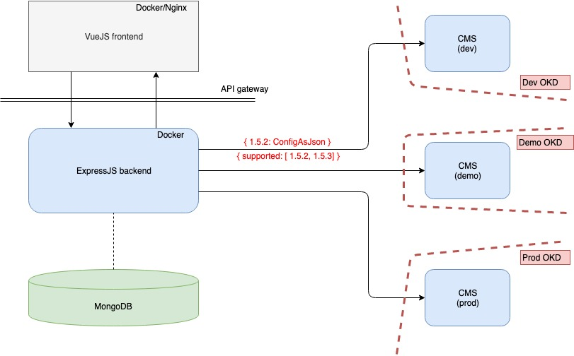

## I. Requirements

### Business
_Everything_ in the app shall be easy to configure through an internal tool.

- <span style="color:green;">Easy update</span>
  - config, text, images, validations...
  - in minutes
- <span style="color:green;">Prod like test</span>
- <span style="color:green;">Safe migrate</span>
  - to dev - to use during development
  - to prod - copy is error prone
- <span style="color:green;">Role and permission management</span>
  - to push to different environments
  - for different ui (for a developer or a business user)
- <span style="color:green;">Safe update</span>
  - check differences
  - trigger "hooks" (tests)
- <span style="color:green;">Support revert</span>

### Development
The ever-changing _InitConfig_ model in swagger shall define the scheme for the content/app configurations made by the business.

- <span style="color:green;">Support scheme mutations</span>
  - new models
  - new fields
- <span style="color:green;">Use real config in development</span>


## II. High level service diagram




## III. Security

Authentication/Authorization - JWT + edge service (not application scope)
  - frontend: jwt payload used for routing, hide/show/disable
  - backend: uses jwt payload, but does not validate (receives validated tokens)

Visibility - only VPN/internal access is enough

## IV. Implementation details

### Tech stack
- Language:
  - Frontend - _Javascript_
  - Backend - _Javascript_

- Framework:
  - Frontend - [_VueJS_](https://vuejs.org/) + [_Vuex_](https://vuex.vuejs.org/guide/)
  - Backend - [_ExpressJS_](https://expressjs.com/)

- Persistence:
  - [_MongoDB_](https://www.mongodb.com/) (+[_Mongoose_](https://mongoosejs.com/))

- Cache:
  - [_Redis_](https://redis.io/)

- Libraries:
  - Swagger validation - [_swagger-object-validator_](https://www.npmjs.com/package/swagger-object-validator)
  - Object comparation - [_deep-object-diff_](https://www.npmjs.com/package/deep-object-diff)
  - Object manipulation - [_lodash_](https://lodash.com/)
  - Design - [_BootstrapVue_](https://bootstrap-vue.js.org/docs/) + [_VueAwesome_](https://github.com/Justineo/vue-awesome)

- Deployment:
  - Frontend - Nginx with static files -> docker image
  - Backend - PM2 + app -> docker image

### Example document in mongoDb - config
```json
{
  "swaggerVersion": 5,     
  "isDeveloperConfig": true,
  "number": 25,                                           

  "markedAsSwaggerUpdateReference": true,
  "finalizedAt": "2019-07-22T13:18:14+00:00Z"   ,                                   
  "finalizedBy": "bela.kovacs@vodafone.hu",

  "initConfigData": "{ localizations: { greeting: { eng: hello, hun: szia } } }",
  "metaData": "{ }",
  "hunSnapshot": "{ localizations: { greeting: szia } }",
  "engSnapshot": "{ localizations: { greeting: hello } }",
  "versionedInitConfigData": "{ localizations: { greeting: { eng: hello, hun: szia } } }"
}
```

- __swaggerVersion__ - incremented for every new swagger
- __isDeveloperConfig__ - marker for search - developers will most likely update a lot
- __number__ - incremented for every finalized initConfig
  - _-> __2.0.24__ (2nd swagger, dev, number 24)_
  - _-> __3.1.12__ (3rd swagger, business, number 12)_
  - _..._

- __markedAsSwaggerUpdateReference__ - marker for search - every once in a while a new swagger with empty values
- __finalizedAt__ - marker for search
- __finalizedBy__ - marker for search


### Example document in mongoDb - mapping
```json
{
  "dev": [
    {
      "supported": [
        "1.0.5",
        "1.0.12"
      ],
      "setAt": "2019-07-22T13:18:14+00:00Z"
    },
    {
      "number": [
        "1.0.12"
      ],
      "setAt": "2019-07-23T13:18:14+00:00Z"
    }
  ],
  "demo": [

  ],
  "prod": [

  ]
}
```

- __dev__ / __demo__ / __prod__ - has a list of version numbers
- __supported__ - the supported versions (latest is recommended)
- __setAt__ - for easier revert


### SWAGGER UPDATE - <span style="color:red;">ALWAYS BACKWARD COMPATIBLE!!!</span>

##### 1. Business requirement
Most of the time it is the business who initiates the changes
  - _"We want a new dashboard tile type where we can present 2 icons and nothing else..."_
  - _"We want to configure multiple different validations for an input field with different messages..."_
  - _"We want to change the background based on tariffs also..."_

##### 2. Frontend-driven swagger update
Keeping in mind:
  - the proper objects for proper abstractions
  - possible future extensions
  - the backward compatibility

##### 3. Check:
For all __config__ (_document_)
  - deep copy _versionedInitConfigData_ -> _versionedInitConfigDataCopy_
    ```js
    var copiedData = JSON.parse(JSON.stringify(originalData))
    // for "data", lodash deepCopy is not even needed (dates, regexes, functions will not work)
    ```
  - add defaultsDeep (updated versionedInitConfigDataCopy)
    ```js
    var _ = require('lodash');

    var dashboardItems = {
      "dashboardItems": []
    }

    var regex = {
      "regex": ""
    }

    _.defaultsDeep(copiedData, dashboardItems)
    copiedData.validations.forEach(validation => _.defaultsDeep(validation, regex))
    ```
  - test that updated versionedInitConfigDataCopy is "superset" of versionedInitConfigData
    ```js
    var _ = require('lodash');

    _.some([copiedData], originalData)
    ```
  - test that snapshots from updated versionedInitConfigDataCopy conforms to both previous and next swagger
    ```js
    var swaggerValidator = require('swagger-object-validator')
    var validator = new swaggerValidator.Handler('frontend-api-spec.yaml')

    validator.validateModel(hunSnapshot, 'InitConfig', (err, result) => /* result.humanReadable() */ )
    ```


### Metadata
```json
{
  "description": "",  
  "imageUrl": "",

  "regex": "",
  "regexHelp": "",                                           

  "availableFrom": "1.0.0",
  "deprecatedFrom": "2.1.12"                   
}
```

- __description__ - Can contain any help, for example for interpolation: {{username}}
- __imageUrl__ - the supported versions (latest is recommended)
- __regex__ - usually only length: __^.{1,50}$__  _(min 1, max 50)_
- __regexHelp__ - To help business with more then a disabled button
- __availableFrom__ - free text, will be rendered on a special place with a bright color; something like "__1.1.5<__"
- __deprecatedFrom__ - free text, will be rendered on a special place with a bright color; something like "__<2.1.5__"

_All fields (just like the entire metadata) are optional_
